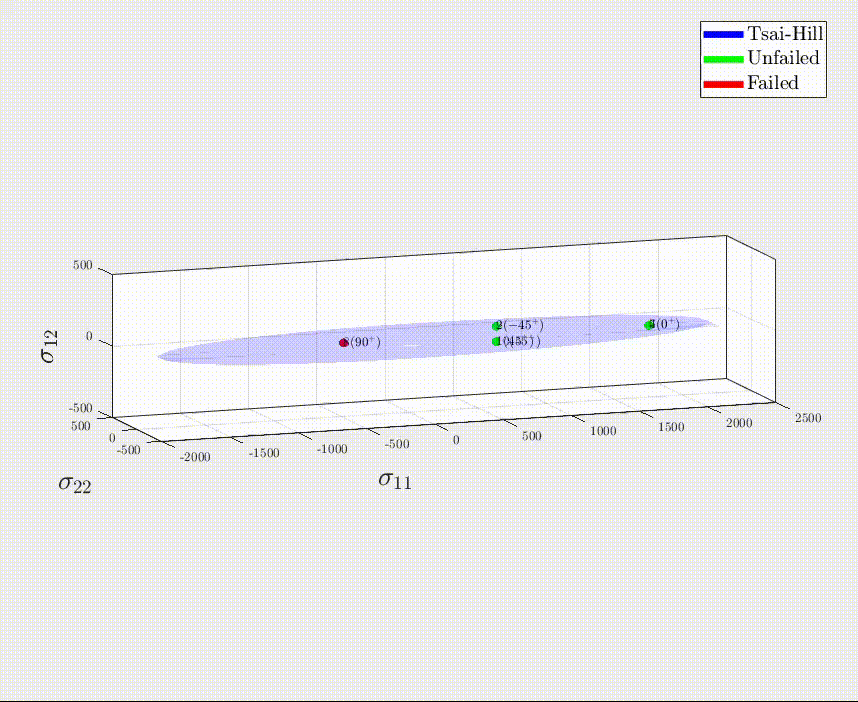

### Hi there 👋, I'm Amir
I'm a Composite Structural Engineer. I like developing codes on solid mechanics, composite analysis and numerical modeling. I usually use Matlab and Python and also like Maple for symbolic operations. Sometimes I upload short documentation on the theoretical material behind my code. You may find them in the report folder of each repository.

Skills: MATLAB / Python / Maple / C++

## Coding Examples
Example from CLTPLUS

Out-of-plane deformation of a rectangular section under torsion using two-dimensional elasticity for aspect ratios a/b=0.1..3

    

  

