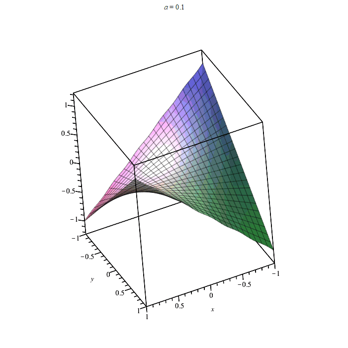

# Hi there 👋, my name's Amir
I'm a composite structural engineer. I like developing codes on solid mechanics, composite analysis and numerical modeling. I usually code in MATLAB and Python and use Maple for my symbolic operations. Sometimes I include short documentations on the thory behind my codes which you can find in *theory* folder of each repository.

## Coding Examples
Example from CLTPLUS (a MATLAB code based on thin composite laminate theory)

Normalized out-of-plane deformation of a rectangular section under torsion using two-dimensional elasticity for various aspect ratios *a/b*=0.1..3 (*a* and *b* are the length and width of the rectangular section)

    

  

